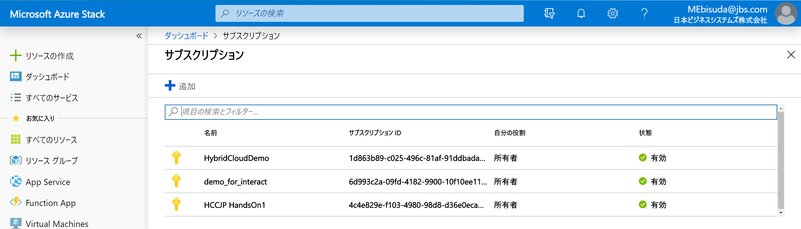
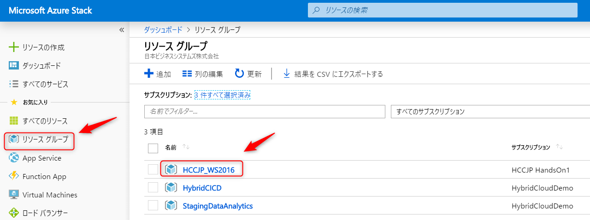
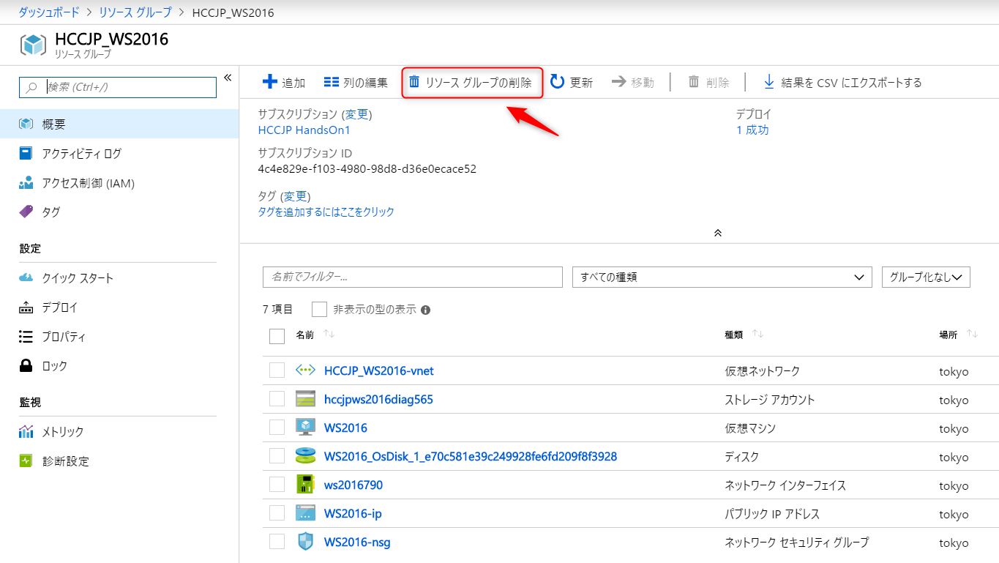
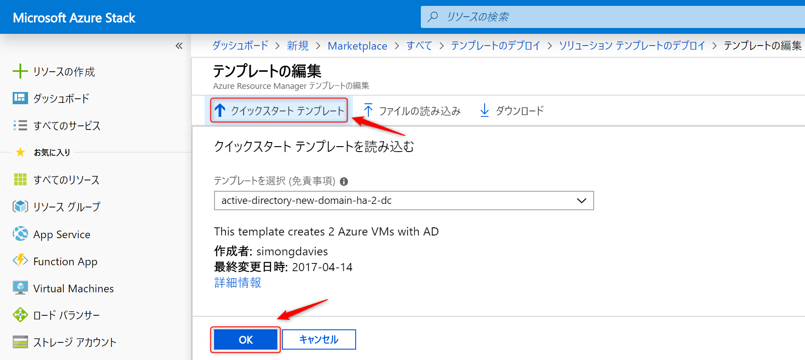
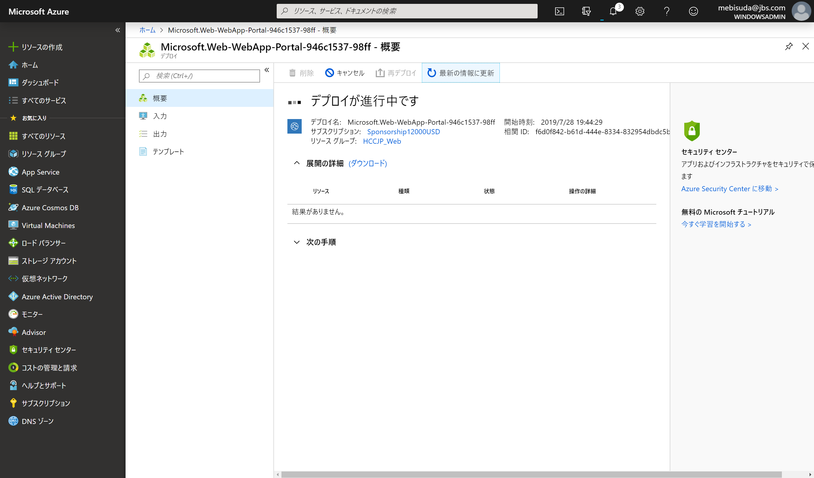
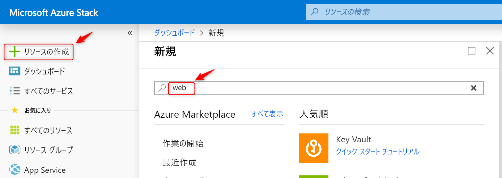
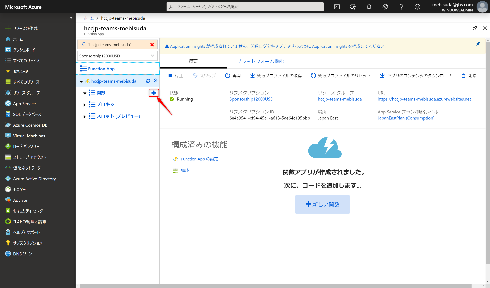
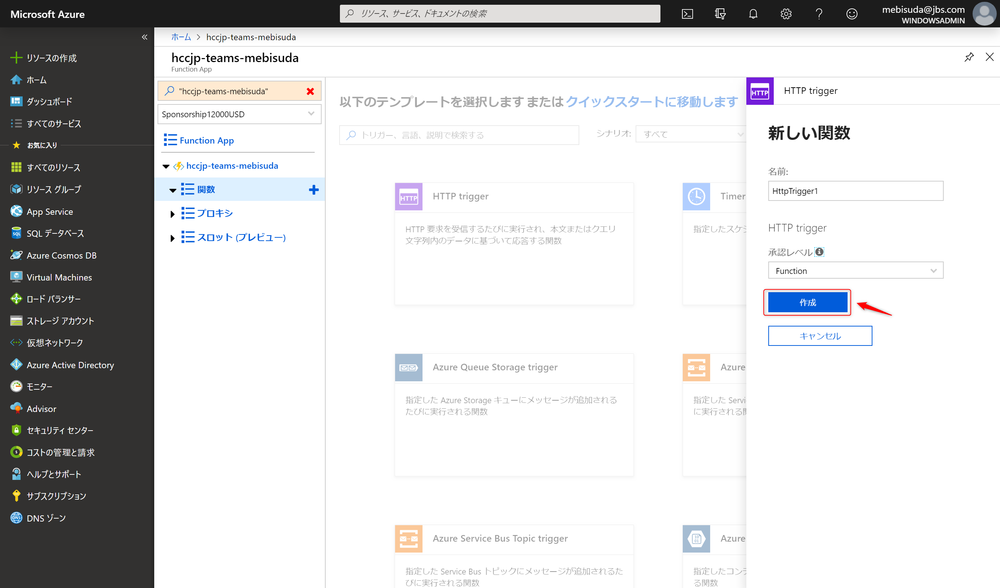
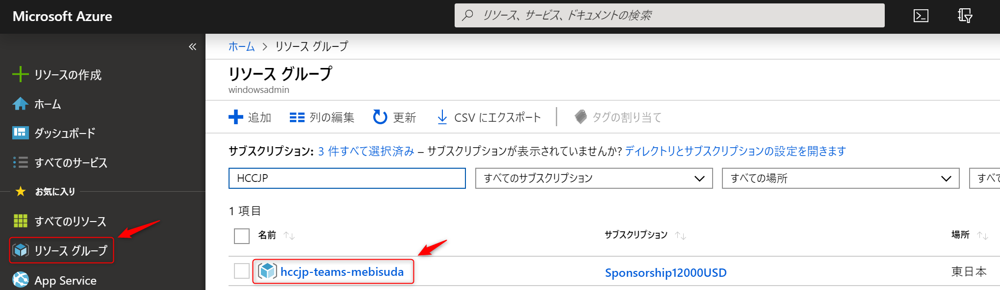

# HCCJP ハンズオン

AzureとAzureStackを用いたIaaS,PaaS,FaaS体験

- スライドURL <https://gitpitch.com/hccjp/hybridcloudhandson1>

---


## ハンズオン目的

このハンズオンではAzureおよびAzure StackをもちいてIaaS, PaaS, FaaSの概要を体験していただきます。

---

## アジェンダ

1. サブスクリプション準備
2. 仮想マシン展開 - ブラウザ
3. 展開後のWindows Server 2016の確認
4. 仮想マシン展開 - PowerShell
5. テンプレート展開
6. コンテナ基盤展開
7. Webサイト作成
8. Teamsにメッセージを送信するWebサービス作成

---

## アジェンダ - 1

1. サブスクリプション準備(←今ここ)
2. 仮想マシン展開 - ブラウザ
3. 展開後のWindows Server 2016の確認
4. 仮想マシン展開 - PowerShell
5. テンプレート展開
6. コンテナ基盤展開
7. Webサイト作成
8. Teamsにメッセージを送信するWebサービス作成

---

## 1. サブスクリプション準備

- ハンズオンで利用するAzure用サブスクリプションを確認します。(各自)
- ハンズオンで利用するAzure Stack用サブスクリプションを確認します。(代表者1名)

---

### Azureサブスクリプション準備(各自)

- Azureサブスクリプションは事前に準備をお願いしていました。
- Azure管理ポータルにアクセスし「サブスクリプション」を表示、確認してください。

---

- <https://portal.azure.com/> にアクセスします
- サブスクリプション一覧を表示します


---

- 有効なサブスクリプションが存在する事を確認します。


---

### AzureStackのサブスクリプションを確認します。(代表者1名

- 管理ポータルにアクセスし「サブスクリプション」を表示、確認します。

---

- Azure Stackの管理ポータルにアクセスします
- サブスクリプション一覧を表示します


---

- 有効なサブスクリプションが存在する事を確認します。



---

## アジェンダ - 2

1. サブスクリプション準備
2. 仮想マシン展開 - ブラウザ(←今ここ)
3. 展開後のWindows Server 2016の確認
4. 仮想マシン展開 - PowerShell
5. テンプレート展開
6. コンテナ基盤展開
7. Webサイト作成
8. Teamsにメッセージを送信するWebサービス作成

---

## 2. 仮想マシン展開 - ブラウザ

- AzureにWindows Server 2016を展開します。(各自)
- Azure StackにWindows Server 2016を展開します。(代表者1名)

---

### AzureにWindows Server 2016を展開します。(各自)

---

@snap[midpoint span-80]


@snapend

---

@snap[midpoint span-80]


@snapend

---

@snap[midpoint span-80]


@snapend

---

@snap[midpoint span-80]


@snapend

---

@snap[midpoint span-80]


@snapend

---

@snap[midpoint span-80]


@snapend

---

@snap[midpoint span-80]


@snapend

---

@snap[midpoint span-80]


@snapend

---

@snap[midpoint span-80]


@snapend

---

@snap[midpoint span-80]


@snapend

---

あとは待てば完了です！

---

### Azure StackにWindows Server 2016を展開します。(代表者1名)

---

@snap[midpoint span-80]


@snapend

---

@snap[midpoint span-80]


@snapend

---

@snap[midpoint span-40]


@snapend

---

@snap[midpoint span-40]


@snapend

---

@snap[midpoint span-80]


@snapend

---

@snap[midpoint span-30]


@snapend

---

@snap[midpoint span-30]


@snapend

---

@snap[midpoint span-50]


@snapend

---

@snap[midpoint span-80]


@snapend

---

@snap[midpoint span-80]


@snapend

---

あとは待てば完了です！

---

## アジェンダ - 3

1. サブスクリプション準備
2. 仮想マシン展開 - ブラウザ
3. 展開後のWindows Server 2016の確認(←今ここ)
4. 仮想マシン展開 - PowerShell
5. テンプレート展開
6. コンテナ基盤展開
7. Webサイト作成
8. Teamsにメッセージを送信するWebサービス作成

---

## 3. 展開後のWindows Server 2016の確認

---

### Azure に展開したWindows Server 2016の確認

---


---


---

### Azure VMの構成


- ※ 引用元：https://blogs.technet.microsoft.com/mskk-cloudos/2016/04/06/azure-ip/

---


---


---


---


---


---


---


---

かんたんに展開でき、きちんと動作していましたね！

---

### Azure Stackに展開したWindows Server 2016の確認

---


---


---


---


---


---


---

@snap[midpoint span-60]


@endsnap

---

@snap[midpoint span-60]


@endsnap

---


---

かんたんに展開でき、きちんと動作していましたね！

---

- 手動でブラウザ上のGUIで仮想マシンを展開する方法を見てもらいました。

---

- 今作成した環境を削除します。
  
---

### Azure 上のリソースの削除

---


---


---


---

### Azure Stack上のリソースの削除

---



---



---


---

## アジェンダ - 4

1. サブスクリプション準備
2. 仮想マシン展開 - ブラウザ
3. 展開後のWindows Server 2016の確認
4. 仮想マシン展開 - PowerShell(←今ここ)
5. テンプレート展開
6. コンテナ基盤展開
7. Webサイト作成
8. Teamsにメッセージを送信するWebサービス作成

---

## 4. 仮想マシン展開 - PowerShell

---

### Azure への仮想マシン展開 - PowerShell

---


---


- BashとPowerShellの選択ではPowerShellを選択してください

---

```
cd $home\clouddrive
git clone https://github.com/hccjp/HybridCloudHandsOn1.git
cd ./HybridCloudHandsOn1/
./NewVM.ps1
location?: JapanEast
```
---


---


---


---

- 確認後リソースグループを削除します。

```
Remove-AzResourceGroup -Name HCCJP_WS2016byPS -Force
```

---

### Azure Stackへの仮想マシン展開 - PowerShell

---

- Azure Stackへの接続が設定されています。


---

```
cd c:\tmp
git clone https://github.com/hccjp/HybridCloudHandsOn1.git
cd ./HybridCloudHandsOn1/
Add-AzureRmAccount -Environment AzureStackUser
./NewVM.ps1
location?: tokyo
```

---

- Azure / Azure Stackともに全く同じスクリプトでVM展開ができました！

---

- 確認後リソースグループを削除します。

```
Remove-AzResourceGroup -Name HCCJP_WS2016byPS -Force
```

---

## アジェンダ - 5

1. サブスクリプション準備
2. 仮想マシン展開 - ブラウザ
3. 展開後のWindows Server 2016の確認
4. 仮想マシン展開 - PowerShell
5. テンプレート展開(←今ここ)
6. コンテナ基盤展開
7. Webサイト作成
8. Teamsにメッセージを送信するWebサービス作成

---

## 5. テンプレート展開

- Azure にARMテンプレートを展開します。
- Azure StackにARMテンプレートを展開します。

---

### Azure にARMテンプレートを展開します

---


---


---


---


---


---


---


---


---


---


---


---


---


---


---


---


---


---


---

- 確認後リソースグループを削除します。


---

### AzureStack にARMテンプレートを展開します

---


---


---


---


---


---



---


---


---


---


---


---


---

- 今回は環境の問題(インターネットの名前解決ができない)でこのテンプレート展開は失敗します。
- 限定的な環境でも展開成功するようにテンプレートにPullRequestを出そうと思います。

---

## アジェンダ - 6

1. サブスクリプション準備
2. 仮想マシン展開 - ブラウザ
3. 展開後のWindows Server 2016の確認
4. 仮想マシン展開 - PowerShell
5. テンプレート展開
6. コンテナ基盤展開(←今ここ)
7. Webサイト作成
8. Teamsにメッセージを送信するWebサービス作成

---

## 6. コンテナ基盤展開

---

### Azure へのコンテナ基盤展開

---


---


---


---


---


---


---


---


---


---


---

### Azure Stackへのコンテナ基盤展開

---


---


---


---

- publickey
  - ssh-rsa AAAAB3NzaC1yc2EAAAADAQABAAACAQDZKRx3tZPzZNc7rEZDPJGM6cZ+DeoN16CnvdK4uP958LJOlko70ah3RAB/WJg3/BS5mCU42AljxNMwJLdo3hYItjj068M37V+cv6D7ewXoACaeYYBH4PGGsFNhf/A6geFdtZt+JdupUlARmNKzoHxawolGLZMV6249S6vz6+bNcAkvQtgbYGbzlRjiE633Hz0mmx7m1+vuRMIjhvq409U6aNgmSHoIiCefNv5oMyFnqCnXMaQnKheQLJoNDVtILycprH/UjUc/pPG8tU1CgfTJVdKuO0JHGf3/21Y1l5UbI0bKpv9kBD1oFzn/I9MNQnYTkEBm6q/EVH0lxH1uwrvQeObyU+aKmsBwKmsaX11cIwU1mRUmhfdi/y6bAHbrYLVQa9+diGw+ClQPbXE9iTLsHiiJdNCgshqSnTqMOwL6nAX4wPeYPpW+5SkfChhrrvwicuHiEWdE/LfGXKc/xNuAwHhe1OTB4C0DRFeiUmEtjQGzRYK3+yUJfRwKW2dfthgfF6TSiM6iA6JKJjIdlRcobxim8kMk8r1ZVaKgIIZ1YjcveeuifXW3KlVPwxnc1DKgXObkTfteYYFKloVCUlIjCn8n+2qa9OIbuhrA4W2hNZHKU2dSNvhzJR3dOu3hz9uvYR5q182aoA1NPaWliV3UqgP/rXdvMExqBB21KrqXBQ== ebibibi@gmail.com

---

- アプリケーション (クライアント) ID
  - HybridCloudDemoSPN
  - 2347abf7-923c-49f9-9660-1e9b687f528b
- アプリケーションシークレット
  - その場で生成します

---


---


---


---


---


---


---


---


---

## アジェンダ - 7

1. サブスクリプション準備
2. 仮想マシン展開 - ブラウザ
3. 展開後のWindows Server 2016の確認
4. 仮想マシン展開 - PowerShell
5. テンプレート展開
6. コンテナ基盤展開
7. Webサイト作成(←今ここ)
8. Teamsにメッセージを送信するWebサービス作成

---

## 7. Webサイト作成

---

### AzureでのWebサイト作成(全員)

---


---


---


---


---


---


---


---


---


---



---


---


---


---

- もろもろ確認したら削除します。

---


---


---


---

### AzureStackでのWebサイト作成(代表１名)

---



---


---


---


---


---


---


---


---


---


---


---

## アジェンダ - 8

1. サブスクリプション準備
2. 仮想マシン展開 - ブラウザ
3. 展開後のWindows Server 2016の確認
4. 仮想マシン展開 - PowerShell
5. テンプレート展開
6. コンテナ基盤展開
7. Webサイト作成(←今ここ)
8. Teamsにメッセージを送信するWebサービス作成

---

## 8. Teamsにメッセージを送信するWebサービス作成

---


---

- Incoming Web Hook
  - https://outlook.office.com/webhook/9260568e-df73-4b63-9668-6349b3ce05ad@88cb30cf-9982-4b0b-950f-243b551e44ba/IncomingWebhook/6aed418937dc4120b583b23391010f2b/4ee8d085-8181-4c77-9626-44218cc2b583

---

### Azureに「Teamsにメッセージを送信するWebサービス」を展開

---


---


---


---


---


---



---


---


---



---


---

```

#r "Newtonsoft.Json"

using System.Net;
using Microsoft.AspNetCore.Mvc;
using Microsoft.Extensions.Primitives;
using System.Collections;
using Newtonsoft.Json;

public static async Task<IActionResult> Run(HttpRequest req, ILogger log)
{
    string message = req.Query["message"];
    string url = "https://outlook.office.com/webhook/9260568e-df73-4b63-9668-6349b3ce05ad@88cb30cf-9982-4b0b-950f-243b551e44ba/IncomingWebhook/6aed418937dc4120b583b23391010f2b/4ee8d085-8181-4c77-9626-44218cc2b583";

    using (HttpClient httpClient = new HttpClient())
    {
    var param = new Hashtable();
    param["Text"] = message;
    var json = JsonConvert.SerializeObject(param);

    var content = new StringContent(json);
    HttpResponseMessage response = await httpClient.PostAsync(url, content);
    }

    return message != null
        ? (ActionResult)new OkObjectResult($"message sent. {message}")
        : new BadRequestObjectResult("Please pass a message on the query string or in the request body");
}
```

---

- コード
- http://bit.ly/2YmDOm1

---


---


---


---


---


---


---


---

- 確認したらリソースグループを削除します。

---



---


---


---

### AzureStackに「Teamsにメッセージを送信するWebサービス」を展開

---


---


---


---


---


---


---


---


---


---

```

#r "Newtonsoft.Json"

using System.Net;
using System.Collections;
using Newtonsoft.Json;

public static async Task<HttpResponseMessage> Run(HttpRequestMessage req, TraceWriter log)
{
    string url = "https://outlook.office.com/webhook/9260568e-df73-4b63-9668-6349b3ce05ad@88cb30cf-9982-4b0b-950f-243b551e44ba/IncomingWebhook/6aed418937dc4120b583b23391010f2b/4ee8d085-8181-4c77-9626-44218cc2b583";

    string message = req.GetQueryNameValuePairs()
        .FirstOrDefault(q => string.Compare(q.Key, "message", true) == 0)
        .Value;

    using (HttpClient httpClient = new HttpClient())
    {
    var param = new Hashtable();
    param["Text"] = message;
    var json = JsonConvert.SerializeObject(param);

    var content = new StringContent(json);
    HttpResponseMessage response = await httpClient.PostAsync(url, content);
    }

    return message == null
        ? req.CreateResponse(HttpStatusCode.BadRequest, "Please pass a name on the query string or in the request body")
        : req.CreateResponse(HttpStatusCode.OK, "message sent. " + message);
}

```

---

- コード
  - http://bit.ly/32Y1mAS

---


---


---


---


---


---

## アジェンダ - 振り返り

1. サブスクリプション準備
2. 仮想マシン展開 - ブラウザ
3. 展開後のWindows Server 2016の確認
4. 仮想マシン展開 - PowerShell
5. テンプレート展開
6. コンテナ基盤展開
7. Webサイト作成
8. Teamsにメッセージを送信するWebサービス作成

---

- 以上でハンズオンは終了です。
- お疲れ様でした！
