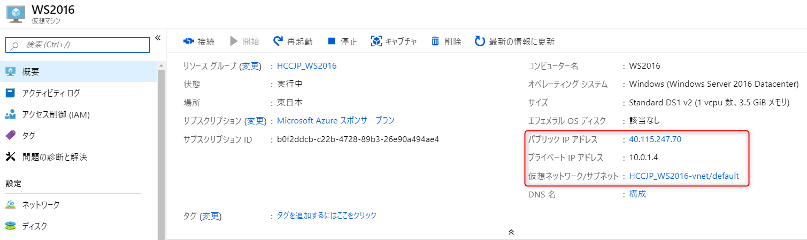
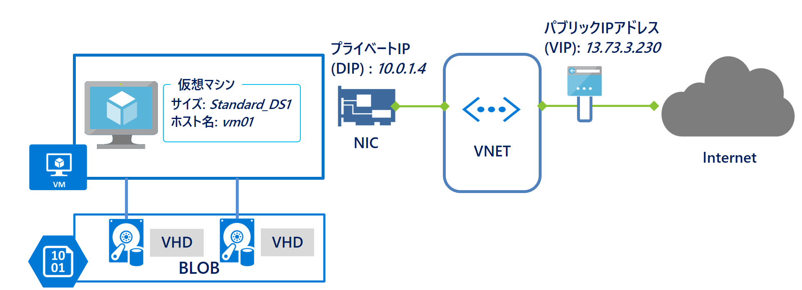

# HCCJP ハンズオン

AzureとAzureStackを用いたIaaS,PaaS,FaaS体験

- スライドURL <https://gitpitch.com/hccjp/hybridcloudhandson1>

---


## ハンズオン目的

このハンズオンではAzureおよびAzure StackをもちいてIaaS, PaaS, FaaSの概要を体験していただきます。

---

## アジェンダ

1. サブスクリプション準備
2. 仮想マシン展開 - ブラウザ
3. 展開後のWindows Server 2016の確認
4. 仮想マシン展開 - PowerShell
5. テンプレート展開
6. コンテナ基盤展開
7. Webサイト作成
8. Teamsにメッセージを送信するWebサービス作成

---

## 1. サブスクリプション準備

---

### 1. サブスクリプション準備 - やること概要

- ハンズオンで利用するAzure用サブスクリプションを確認します。(各自)
- ハンズオンで利用するAzure Stack用サブスクリプションを確認します。(代表者1名)

---

### Azureサブスクリプション準備(各自)

- Azureサブスクリプションは事前に準備をお願いしていました。
- Azure管理ポータルにアクセスし「サブスクリプション」を表示、確認してください。

---

### Azureサブスクリプション準備(各自) - 手順(1/2)

- <https://portal.azure.com/> にアクセスします
- サブスクリプション一覧を表示します


---

### Azureサブスクリプション準備(各自) - 手順(2/2)

- 有効なサブスクリプションが存在する事を確認します。


---

### Azure Stackサブスクリプション準備(代表者1名)

- AzureStack管理ポータルにアクセスし「サブスクリプション」を表示、確認します。

---

### Azure Stackサブスクリプション準備(代表者1名) - 手順(1/2)

- Azure Stackの管理ポータルにアクセスします
- サブスクリプション一覧を表示します


---

### Azure Stackサブスクリプション準備(代表者1名) - 手順(2/2)

- 有効なサブスクリプションが存在する事を確認します。


---

## 2. 仮想マシン展開 - ブラウザ

---

### 2. 仮想マシン展開 - ブラウザ - やること概要

- AzureにWindows Server 2016を展開します。(各自)
- Azure StackにWindows Server 2016を展開します。(代表者1名)

---

### AzureにWindows Server 2016を展開します。(各自)

---

#### AzureにWindows Server 2016を展開 (1/10)


---

#### AzureにWindows Server 2016を展開 (2/10)


---

#### AzureにWindows Server 2016を展開 (3/10)


---

#### AzureにWindows Server 2016を展開 (4/10)


---

#### AzureにWindows Server 2016を展開 (5/10)


---

#### AzureにWindows Server 2016を展開 (6/10)


---

#### AzureにWindows Server 2016を展開 (7/10)


---

#### AzureにWindows Server 2016を展開 (8/10)


---

#### AzureにWindows Server 2016を展開 (9/10)


---

#### AzureにWindows Server 2016を展開 (10/10)


---

あとは待てば完了です！

---

## Azure StackにWindows Server 2016を展開します。(代表者1名)

---

### Azure StackにWindows Server 2016を展開 (1/10)


---

### Azure StackにWindows Server 2016を展開 (2/10)


---

### Azure StackにWindows Server 2016を展開 (3/10)

@snap[midpoint span-80]


@snapend

---

### Azure StackにWindows Server 2016を展開 (4/10)


---

### Azure StackにWindows Server 2016を展開 (5/10)


---

### Azure StackにWindows Server 2016を展開 (6/10)


---

### Azure StackにWindows Server 2016を展開 (7/10)


---

### Azure StackにWindows Server 2016を展開 (8/10)


---

### Azure StackにWindows Server 2016を展開 (9/10)


---

### Azure StackにWindows Server 2016を展開 (10/10)


---

あとは待てば完了です！

---

## 展開後のWindows Server 2016の確認

---

### Azureに展開したWindows Server 2016の確認 (1/10)


---

### Azureに展開したWindows Server 2016の確認 (2/10)



---

### Azureに展開したWindows Server 2016の確認 (3/10)


- ※ 引用元：https://blogs.technet.microsoft.com/mskk-cloudos/2016/04/06/azure-ip/

---

### Azureに展開したWindows Server 2016の確認 (4/10)


---

### Azureに展開したWindows Server 2016の確認 (5/10)


---

### Azureに展開したWindows Server 2016の確認 (6/10)


---

### Azureに展開したWindows Server 2016の確認 (7/10)


---

### Azureに展開したWindows Server 2016の確認 (8/10)


---

### Azureに展開したWindows Server 2016の確認 (9/10)


---

### Azureに展開したWindows Server 2016の確認 (10/10)


---

かんたんに展開でき、きちんと動作していましたね！

---

### Azure Stackに展開したWindows Server 2016の確認 (1/9)


---

### Azure Stackに展開したWindows Server 2016の確認 (2/9)


---

### Azure Stackに展開したWindows Server 2016の確認 (3/9)


---

### Azure Stackに展開したWindows Server 2016の確認 (4/9)


---

### Azure Stackに展開したWindows Server 2016の確認 (5/9)


---

### Azure Stackに展開したWindows Server 2016の確認 (6/9)


---

### Azure Stackに展開したWindows Server 2016の確認 (7/9)


---

### Azure Stackに展開したWindows Server 2016の確認 (8/9)


---

### Azure Stackに展開したWindows Server 2016の確認 (9/9)


---

かんたんに展開でき、きちんと動作していましたね！

---

## テンプレート

- 展開済みリソースのARMテンプレート確認
- (ARMテンプレート)Azure Quick Start Templateからの展開 - ブラウザ
- (ARMテンプレート)Azure Stack Quick Start Templateからの展開 - ブラウザ

---

## コンテナ

これから下記の操作を行います。

- 仮想マシン(Linux)をAzure CLIで展開
- コンテナでHello World
- コンテナでwhalesay
- イメージ作成
- Docker Hubにアップロード
- Wordpressの実行

---

## サブスクリプションをハンズオン用のものに設定

- ディレクトリを *windowsadmin* に変更
- Cloud Shell(Bash)を起動
- az account set --subscription *ハンズオンで使用するサブスクリプション名*
- az account show
  - 正しいサブスクリプションが設定されていることを確認

---

## コンテナ検証用VMをAzureに展開

- NAME=*自分の名前*
- az group create --name ${NAME}ContainerTest --location japaneast
- az vm create \
    --resource-group ${NAME}ContainerTest \
    --name ContainerTestVM \
    --image UbuntuLTS \
    --admin-username ${NAME} \
    --generate-ssh-keys
- (VMの作成を数分待ちます)
- 結果表示からpublicIPアドレスを確認します。

---

## 展開したVMにアクセス

- ssh ${NAME}@*確認したパブリックIPアドレス*
- "Are you sure you want to continue connection (yes/no)?"にyesで回答

---

## コンテナでHello World

- sudo apt install docker.io
- "Do you want to continue? [Y/n]" Y
- sudo docker container run hello-world
- 表示されたメッセージに注目

---

## コンテナイメージの確認

- sudo docker images

---

## whalesayイメージの取得～実行

- sudo docker pull docker/whalesay
- sudo docker images
- sudo docker run docker/whalesay cowsay Hello World!

---

## Dockerfile作成の準備(エディタ準備)

- sudo apt-get install emacs
- mkdir mybuild
- cd mybuild

---

## fortunes入りコンテナイメージ[mywhale]の定義

- emacs Dockerfile

```dockerfile
FROM docker/whalesay:latest
RUN apt-get -y update && apt-get install -y fortunes
CMD /usr/games/fortune -a | cowsay
```

- ファイル保存～終了(Ctrl-x,s -> Ctrl-x,c)

---

## fortunes入りコンテナイメージ[mywhale]の作成

- sudo docker build -t mywhale .
- sudo docker images

---

## fortunes入りコンテナイメージ[mywhale]の実行

- sudo docker run mywhale

---

## 作成したイメージのDockerHubへの公開

- sudo docker login
- sudo docker tag mywhale *自分のアカウント名*/mywhale
- sudo docker images
- sudo docker push *自分のアカウント名*/mywhale

---

## コンテナイメージの削除

- sudo docker rmi -f mywhale ebibibi/mywhale
- sudo docker images

---

## コンテナイメージのDockerHubからの取得と実行

- sudo docker pull ebibibi/mywhale
- sudo docker run ebibibi/mywhale

---

## コンテナ環境の削除

- sudo docker system prune
- "Are you sure you want to continue? [y/N]" Y

---

## docker-composeによる複数コンテナシステム

---

## docker-composeの準備

- sudo curl -L "https://github.com/docker/compose/releases/download/1.23.2/docker-compose-$(uname -s)-$(uname -m)" -o /usr/local/bin/docker-compose
- sudo chmod +x /usr/local/bin/docker-compose
- docker-compose version

---

## docker-compose.ymlの作成

- cd ~
- mkdir Wordpress
- cd Wordpress
- emacs docker-compose.yml

---

## docker-compose

```docker-compose
version: '3.1'

services:

  wordpress:
    image: wordpress
    ports:
      - 80:80
    environment:
      WORDPRESS_DB_PASSWORD: example

  mysql:
    image: mysql:5.7
    environment:
      MYSQL_ROOT_PASSWORD: example
```

- ファイル保存～終了(Ctrl-x,s -> Ctrl-x,c)

---

## docker-composeによるイメージ取得

- sudo docker-compose pull
- sudo docker images

---

## docker-composeによるコンテナ実行(mysql)

- sudo docker-compose up -d mysql
- sudo docker-compose ps
- sudo docker-compose logs -f

---

## docker-composeによるコンテナ実行(wordpress全体)

- sudo docker-compose up -d
- sudo docker-compose logs -f wordpress

---

## NSG(Network Security Group)へのルール追加

- exit
- az network nsg rule create -g ${NAME}ContainerTest --nsg-name ContainerTestVMNSG  --name AllowHTTP--destination-address-prefix '*' --destination-port-ranges 80 --protocol TCP --priority 2000

---

## Wordpressの表示

- ブラウザで仮想マシンが保持するパブリックIPアドレスにアクセス
- (az network public-ip list | grep ipAddress)

---

## docker-composeによるコンテナ停止

- ssh ${NAME}@*確認したパブリックIPアドレス*
- cd Wordpress
- sudo docker-compose stop
- sudo docker-compose down
- sudo docker-compose ps

---

## 環境の削除

- sudo docker system prune
- "Are you sure you want to continue? [y/N]" Y
- exit

---

## リソースグループの削除

- az group delete --name ${NAME}ContainerTest -y

---

## PaaS

- AzureへのWebサイトの作成
- AzureStackへのへのWebサイトの作成
- SQL Databaseの作成
- Wordpressサイトの作成

---

## Serverless

- FunctionsでTeamsにメッセージを送信

---

## AzureStackオペレーターとしての体験

Azure StackにはAzureにはない特徴としてAzure Stackオペレーター用の管理ポータルがありオペレーション業務が行えます。これはAzure Stackがオンプレミスに存在し用途に合わせてカスタマイズできる基盤であるためです。

@snapend
